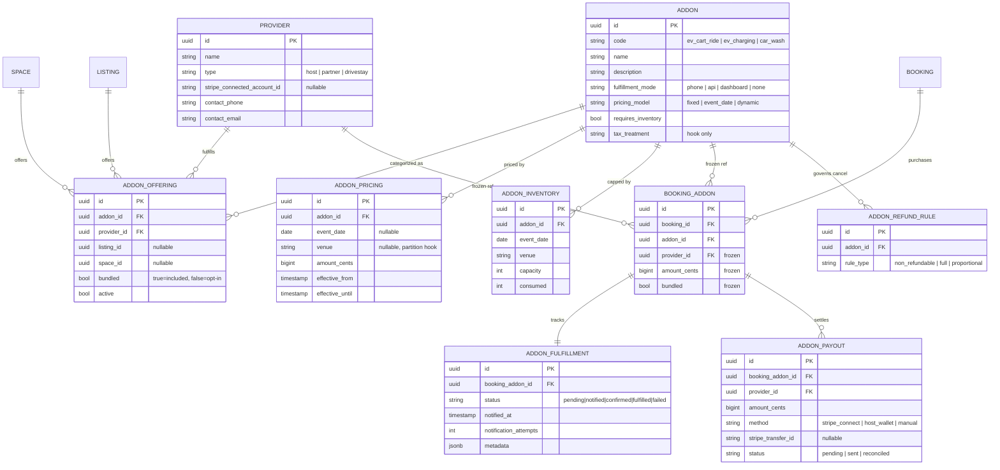
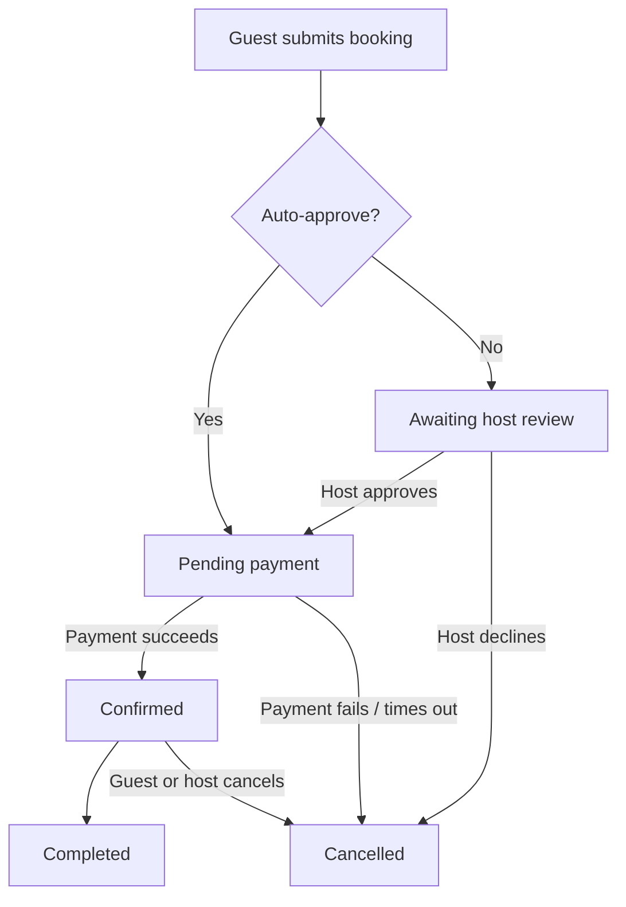
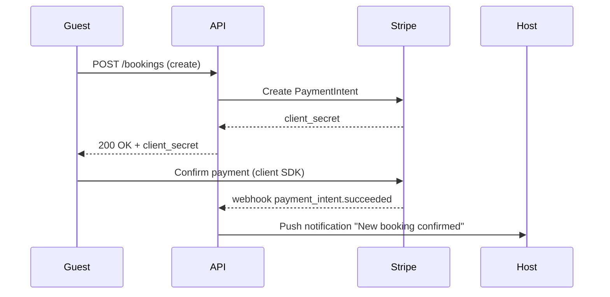

# Mermaid Demo

This file is a visual smoke test for the Mermaid rendering feature in the `marko` markdown reader. It mixes several Mermaid diagram types (ER, flowchart, sequence) with regular prose, headings, lists, and a plain fenced code block — so we can confirm that Mermaid blocks render as diagrams while ordinary code blocks continue to render with normal syntax highlighting.

## 1. Entity-Relationship Diagram

The ER diagram below models the add-on / provider / booking domain. It exercises Mermaid's `erDiagram` syntax including cardinalities, labeled relationships, primary/foreign keys, nullable columns, and inline comments on fields.



A few things to look for in the rendered ER diagram:

- All ten entities are present and laid out without overlap.
- Relationship labels (e.g. "frozen ref", "governs cancel") are readable.
- The `||--||` (one-to-one) edge between `BOOKING_ADDON` and `ADDON_FULFILLMENT` is visually distinct from the `||--o{` (one-to-many) edges.

## 2. Booking Lifecycle Flowchart

A simple top-down flowchart that walks a booking through its states. It tests `flowchart TD`, decision nodes, and a cancelled branch.



## 3. Payment Sequence Diagram

This sequence diagram shows the happy-path payment handshake between the guest, our API, Stripe, and the host. It exercises `sequenceDiagram`, participants, and a mix of sync and async messages.



## 4. Plain Code Block (Not Mermaid)

The fenced block below is a regular Go snippet. It must render as syntax-highlighted source code, **not** as a Mermaid diagram. If it gets handed to the Mermaid renderer it will either fail to parse or render as garbage — that's the bug we're guarding against.

```go
package main

import "fmt"

func main() {
    statuses := []string{"pending", "confirmed", "completed"}
    for i, s := range statuses {
        fmt.Printf("%d: %s\n", i, s)
    }
}
```

And for good measure, a second non-mermaid block in a different language:

```javascript
const states = ["pending", "confirmed", "completed", "cancelled"];
const isTerminal = (s) => s === "completed" || s === "cancelled";

for (const s of states) {
  console.log(`${s} -> terminal? ${isTerminal(s)}`);
}
```

## Checklist

When viewing this file in `marko`, verify:

- [ ] The ER diagram renders as a diagram (not as raw text).
- [ ] The flowchart renders with arrows and decision diamonds.
- [ ] The sequence diagram shows the four participants and arrows between them.
- [ ] The Go and JavaScript blocks render as syntax-highlighted code, not as diagrams.
- [ ] Headings, paragraphs, and the bullet list around the diagrams render normally.
